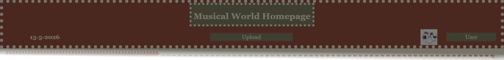
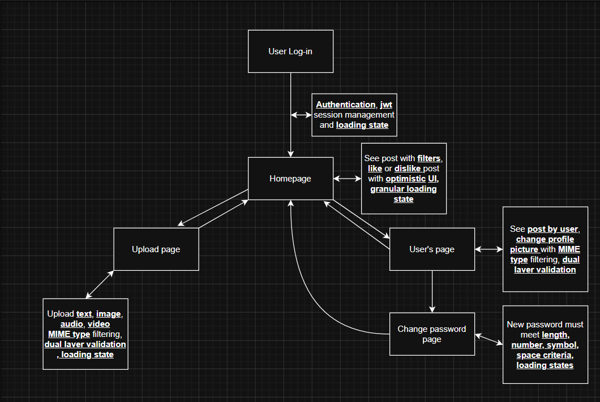

#**MucicalWorld - MERN stack application with social elements**

This website is my project for my resume, This is a MERN applicaiton that **focuses on security while showcasing social elements** achievable with MERN stack

This projects include
hashing password using bcrypt, resisting nosql injection attacks, using CORS library, using JWT tokens in httponly cookie, protected routes and secret environment variables, making a new account is disabled to get username and password please contact me

User can upload text, audio, image and video while using filters on homepage to filter post or see the latest ones, user can like or dislike on post, user can also upload and change profile picture and change password

Libraries used:
bcrypt \n
multer
jsonwebtoken
path
mongoose
cors
cloudinary
react-router
